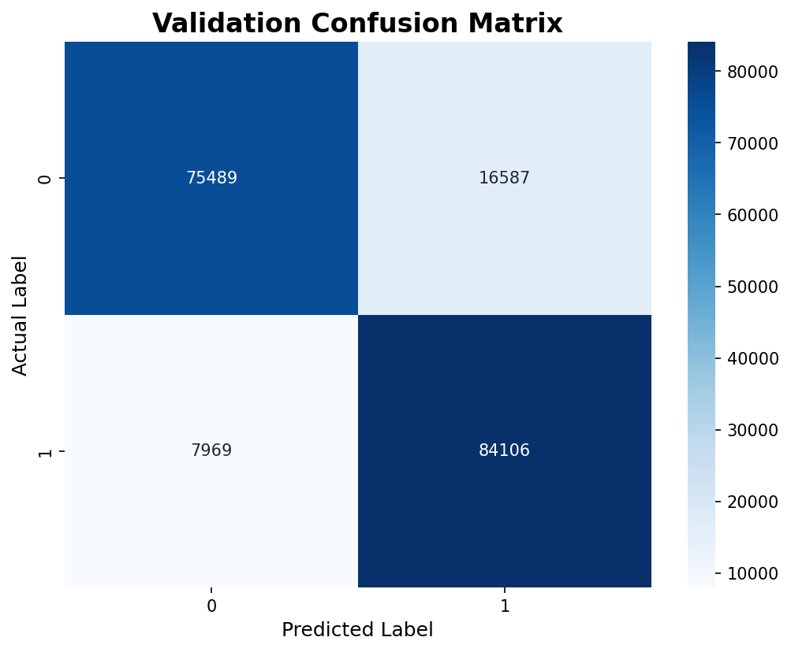

# Customer Churn Prediction - ML Pipeline

## Từ điển Dữ liệu (Data Dictionary)

Thông tin dataset xem chi tiết ở [docs/dataset.md](docs/dataset.md)

Dự án dự đoán khách hàng rời bỏ dịch vụ (Customer Churn) sử dụng Machine Learning với kiến trúc MLOps Pipeline hoàn chỉnh.

## 🎯 Tổng quan dự án

Dự án này xây dựng một pipeline ML hoàn chỉnh gồm 6 giai đoạn:

1. **Data Ingestion**: Thu thập và giải nén dữ liệu
2. **Data Validation**: Kiểm tra tính hợp lệ của dữ liệu
3. **Data Transformation**: Feature engineering, preprocessing, và SMOTE
4. **Model Training**: Huấn luyện và tối ưu hóa mô hình (LightGBM & XGBoost)
5. **Model Evaluation**: Đánh giá và tracking với MLflow
6. **Model Prediction / Inference**: Dự đoán dữ liệu mới (Test Set/Submission)

## 📁 Cấu trúc dự án

```
customer_churn_prediction/
├── config/                          # Các file cấu hình
│   ├── config.yaml                  # Cấu hình đường dẫn cho từng stage
│   ├── schema.yaml                  # Định nghĩa schema của dữ liệu
│   ├── logging.yaml                 # Cấu hình logging
│   └── params.yaml                  # Hyperparameters cho model training
│
├── src/                             # Source code chính
│   ├── components/                  # Các component xử lý logic
│   ├── config/                      # Configuration management
│   ├── entity/                      # Data entities (dataclasses)
│   ├── pipeline/                    # Pipeline wrappers cho từng stage
│   └── utils/                       # Utility functions
│
├── data/                            # Dữ liệu thô (zip files)
├── artifacts/                       # Outputs từ các stages
├── logs/                            # Log files
├── mlruns/                          # MLflow tracking data
├── EDA/                             # Exploratory Data Analysis notebooks
│
├── main.py                          # Entry point - chạy toàn bộ pipeline
├── requirements.txt                 # Python dependencies
└── README.md                        # Documentation (file này)
```

---

## 📂 Chi tiết các thư mục

Chi tiết cấu trúc và giải thích về các thư mục/file có thể xem tại: [src/README.md](src/README.md)

---

## 🚀 Hướng dẫn sử dụng

### 1. Cài đặt môi trường

```bash
# Clone repository
git clone <repository-url>
cd customer_churn_prediction

# Tạo virtual environment
python -m venv venv

# Activate virtual environment
# Windows:
venv\Scripts\activate
# Linux/Mac:
source venv/bin/activate

# Cài đặt dependencies
pip install -r requirements.txt
```

### 2. Chuẩn bị dữ liệu

Đặt file `playground-series-s6e3.zip` vào thư mục `data/`:

```
data/
└── playground-series-s6e3.zip
```

### 3. Chạy toàn bộ pipeline

```bash
python main.py
```

**Thời gian ước tính**: 15-20 phút

- Stage 1-3: ~30 giây
- Stage 4 (Training): ~10-15 phút (Tuning bằng Optuna)
- Stage 5 (Evaluation): ~10 giây
- Stage 6 (Prediction & Submission): ~15 giây

### 4. Xem kết quả trong MLflow

```bash
mlflow ui
```

Truy cập: http://localhost:5000

Trong MLflow UI bạn sẽ thấy:

- **Experiments**: Các lần chạy training
- **Runs**: LightGBM_Training, XGBoost_Training, Model_Evaluation
- **Metrics**: ROC AUC, F1-Score, Accuracy, Precision, Recall
- **Parameters**: Hyperparameters của từng mô hình
- **Artifacts**: Models, Confusion Matrix, ROC Curve

### 5. Chạy từng stage riêng lẻ (để debug)

```bash
# Stage 1: Data Ingestion
python src/pipeline/stage_01_data_ingestion.py

# Stage 2: Data Validation
python src/pipeline/stage_02_data_validation.py

# Stage 3: Data Transformation
python src/pipeline/stage_03_data_transformation.py

# Stage 4: Model Training
python src/pipeline/stage_04_model_trainer.py

# Stage 5: Model Evaluation
python src/pipeline/stage_05_model_evaluation.py

# Stage 6: Prediction & Submission
python src/pipeline/stage_06_prediction.py

# Hoặc có thể chạy nhanh script prediction độc lập:
python predict.py
```

---

## 📊 Kết quả chi tiết

### Model Performance (Validation Set)

| Mô hình                | Accuracy | Precision | Recall | F1-Score | ROC AUC    | Kết quả         |
| ---------------------- | -------- | --------- | ------ | -------- | ---------- | --------------- |
| **StackingClassifier** | 86.54%   | 84.32%    | 89.77% | 86.96%   | **93.56%** | ✅ **Tốt nhất** |
| XGBoost                | 86.52%   | 83.64%    | 90.80% | 87.07%   | 93.52%     | Tốt             |
| LightGBM               | 86.35%   | 83.44%    | 90.71% | 86.92%   | 93.41%     | Khá             |
| CatBoost               | 86.33%   | 83.48%    | 90.58% | 86.89%   | 93.39%     | Khá             |

## 📊 Kết quả đạt được

- **Mô hình tốt nhất**: StackingClassifier (Ensemble của LightGBM, XGBoost, CatBoost)
- **ROC AUC Score**: 93.56%
- **F1-Score**: 86.96%
- **Dataset**: Kaggle Playground Series S6E3 (~594k training samples)
- **Features**: 33 features sau feature engineering và preprocessing (áp dụng SMOTE cân bằng nhãn)

### 📈 Biểu đồ đánh giá

Để trực quan hóa hiệu suất phân loại của mô hình tốt nhất, các biểu đồ đánh giá đã được vẽ và lưu trữ trong thư mục `docs/`:

#### 1. Confusion Matrix



#### 2. ROC Curve

![ROC Curve]

### Artifacts được tạo ra

```
artifacts/
├── data_ingestion/
│   ├── train.csv                       # 594,194 rows
│   └── test.csv                        # 254,655 rows
│
├── data_validation/
│   └── status.txt                      # Validation status: True
│
├── data_transformation/
│   ├── train_transformed.npz           # 920,740 rows, 33 features (sau SMOTE)
│   ├── test_transformed.npz            # 254,653 rows, 33 features
│   └── preprocessor.joblib             # Sklearn pipeline đã fit
│
├── model_trainer/
│   ├── model.joblib                    # StackingClassifier model (tốt nhất)
│   └── metrics.json                    # ROC AUC: 0.9356
│
├── model_evaluation/
│   └── predictions.npz                 # Predictions cho test set
│
└── prediction/                         # Thư mục artifacts dự đoán (Stage 6)
```

Và ở thư mục gốc:

- `submission.csv` # File nộp bài Kaggle cuối cùng (chứa id, Churn)

````

---

## 🔧 Cấu hình nâng cao

### Thay đổi Hyperparameters

Chỉnh sửa `params.yaml`:

```yaml
LightGBM:
  n_estimators: [100, 200, 300] # Thêm giá trị mới
  max_depth: [3, 5, 7, 10] # Thêm giá trị mới
  learning_rate: [0.01, 0.1] # Thêm learning rate khác
````

### Thay đổi đường dẫn artifacts

Chỉnh sửa `config/config.yaml`:

```yaml
artifacts_root: my_custom_artifacts # Thay đổi thư mục gốc

model_trainer:
  root_dir: my_custom_artifacts/models
  model_name: my_model.joblib
```

### Cấu hình MLflow Tracking Server

Chỉnh sửa `config/config.yaml`:

```yaml
model_trainer:
  mlflow_uri: "http://your-mlflow-server:5000"

model_evaluation:
  mlflow_uri: "http://your-mlflow-server:5000"
```

---

## 📚 Tài liệu tham khảo

- [Kaggle Competition: Playground Series S6E3](https://www.kaggle.com/competitions/playground-series-s6e3)
- [MLflow Documentation](https://mlflow.org/docs/latest/index.html)
- [LightGBM Documentation](https://lightgbm.readthedocs.io/)
- [XGBoost Documentation](https://xgboost.readthedocs.io/)
- [Scikit-learn Pipeline](https://scikit-learn.org/stable/modules/compose.html)

---

## 📞 Liên hệ

Nếu có câu hỏi hoặc vấn đề, vui lòng tạo issue trên GitHub repository.

---

**Version**: 1.0.0  
**Status**: ✅ Production Ready
