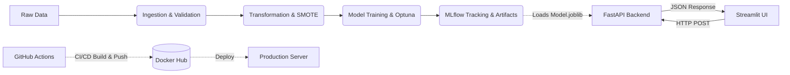

# Customer Churn Prediction - End-to-End MLOps Pipeline


Dự án dự đoán khách hàng rời bỏ dịch vụ (Customer Churn) sử dụng Machine Learning với kiến trúc **MLOps Hoàn chỉnh** (End-to-End). Hệ thống bao gồm từ việc tự động hóa quá trình xử lý dữ liệu, huấn luyện mô hình, cho đến việc đóng gói (Containerization) và triển khai (CI/CD) một ứng dụng Web Microservices hoàn chỉnh.

---

## Điểm Nổi Bật Của Hệ Thống

1. **Microservices Architecture**:
   - **Backend API**: Xây dựng bằng `FastAPI`, phục vụ Model Inference với tốc độ cao qua các RESTful endpoint (`/predict`).
   - **Frontend UI**: Xây dựng bằng `Streamlit` (Dashboard & Inference UI), giao tiếp mượt mà với Backend.
2. **Robust MLOps Pipeline**:
   - Tự động hóa 6 giai đoạn: *Ingestion -> Validation -> Transformation -> Training -> Evaluation -> Prediction*.
   - Theo dõi thực nghiệm (Experiment Tracking) và quản lý vòng đời mô hình bằng **MLflow**.
   - Tối ưu hóa siêu tham số (Hyperparameter Tuning) hoàn toàn tự động bằng **Optuna**.
3. **Production Ready**:
   - **Dockerized**: Đóng gói toàn bộ ứng dụng (Backend + Frontend) vào một Docker Container duy nhất.
   - **CI/CD Automation**: Tích hợp GitHub Actions.
     - **CI**: Tự động chạy Unit Test (`pytest`) và kiểm tra mã nguồn (`flake8`) khi có Pull Request.
     - **CD**: Tự động Build và Push ảnh Docker lên Docker Hub mỗi khi code được đẩy lên nhánh `main`.

---

## Kiến Trúc Hệ Thống (System Architecture)



---

## Hướng Dẫn Sử Dụng Nhanh (Quick Start)

Có 2 cách để chạy hệ thống: Dùng **Docker (Khuyến nghị)** hoặc chạy **Local (Cho Developer)**.

### Cách 1: Sử dụng Docker (Dành cho Production)

Bạn không cần cài đặt Python hay bất kỳ thư viện nào, chỉ cần máy tính có Docker:

```bash
# 1. Pull Image mới nhất từ Docker Hub
docker pull hoangkhang226/mlops-churn-dashboard:latest

# 2. Chạy Container (Mở cổng 8501 cho Streamlit và 8000 cho FastAPI)
docker run -p 8501:8501 -p 8000:8000 hoangkhang226/mlops-churn-dashboard:latest
```
- **Streamlit Dashboard**: Truy cập `http://localhost:8501`
- **FastAPI Swagger UI**: Truy cập `http://localhost:8000/docs`

### Cách 2: Chạy Local (Dành cho Developer)

```bash
# 1. Clone repository
git clone <repository-url>
cd customer_churn_prediction

# 2. Tạo virtual environment và kích hoạt
python -m venv venv
venv\Scripts\activate      # Windows
# source venv/bin/activate # Linux/Mac

# 3. Cài đặt dependencies
pip install -r requirements.txt

# 4. Chạy toàn bộ hệ thống (Bao gồm FastAPI và Streamlit)
bash start.sh
```

---

## Huấn luyện lại Mô hình (Retrain Pipeline)

Nếu bạn muốn chạy lại quy trình huấn luyện từ đầu với tập dữ liệu mới:

```bash
# Chạy toàn bộ ML Pipeline (Tốn khoảng 15-20 phút)
python main.py
```

Các bước Pipeline sẽ thực thi:
1. **Data Ingestion**: Đọc dữ liệu từ `data/`
2. **Data Validation**: Xác thực lược đồ (Schema validation)
3. **Data Transformation**: Feature Engineering, Scaling và Cân bằng dữ liệu (SMOTE).
4. **Model Training**: Huấn luyện tập hợp mô hình (LightGBM, XGBoost, CatBoost) và StackingClassifier.
5. **Model Evaluation**: Đánh giá hiệu suất và ghi lại metrics vào MLflow.
6. **Prediction**: Tạo file submission.csv cho tệp test.

Để xem kết quả huấn luyện qua giao diện:
```bash
mlflow ui
```
Truy cập: `http://localhost:5000`

---

## Cấu trúc Dự án (Project Structure)

```
mlop_project/
├── .github/workflows/               # GitHub Actions CI/CD pipelines (ci.yml, cd.yml)
├── artifacts/                       # Kết quả sinh ra từ ML Pipeline (Models, Processors)
├── config/                          # File cấu hình YAML (params, schema, routes)
├── src/
│   ├── backend/                     # Mã nguồn FastAPI
│   │   ├── endpoints/
│   │   │   └── predict.py           # API Endpoint inference
│   │   └── main.py                  # Entrypoint FastAPI
│   ├── pipeline/                    # Các module huấn luyện MLOps (Stage 1-6)
│   └── ui/                          # Frontend Streamlit (dashboard.py, predict.py)
├── tests/                           # Unit tests chạy bằng pytest
├── Dockerfile                       # Cấu hình đóng gói hệ thống
├── start.sh                         # Script khởi động Backend & Frontend
├── main.py                          # File thực thi huấn luyện Pipeline
└── app.py                           # File thực thi giao diện Streamlit
```

---

## Hiệu suất Mô hình (Model Performance)

Thuật toán tốt nhất hiện tại là **StackingClassifier** (kết hợp LightGBM, XGBoost, CatBoost).

| Mô hình                | Accuracy | Precision | Recall | F1-Score | ROC AUC    | Kết quả         |
| ---------------------- | -------- | --------- | ------ | -------- | ---------- | --------------- |
| **StackingClassifier** | 86.54%   | 84.32%    | 89.77% | 86.96%   | **93.56%** | **Tốt nhất**    |
| XGBoost                | 86.52%   | 83.64%    | 90.80% | 87.07%   | 93.52%     | Tốt             |
| LightGBM               | 86.35%   | 83.44%    | 90.71% | 86.92%   | 93.41%     | Khá             |

*Các biểu đồ Confusion Matrix và ROC Curve được sinh tự động trong thư mục `docs/` sau mỗi lần huấn luyện.*

---

## Liên Hệ & Đóng Góp

Dự án này là minh chứng cho một kiến trúc MLOps toàn diện. Nếu bạn có câu hỏi hoặc đóng góp, vui lòng tạo **Issue** hoặc **Pull Request** trực tiếp trên repository này!

**Version**: 1.0.0  
**Status**: Production Ready (Docker + CI/CD)
